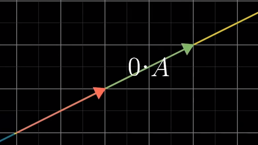
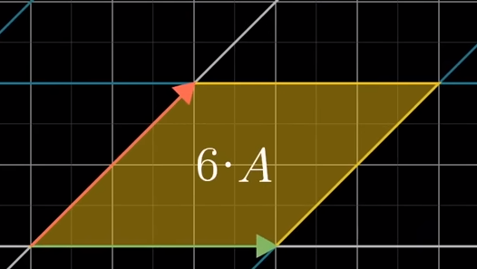

# Matrix

An introduction to Linear Algebra

----

## Menu

### I. Principles of Complexity
- [Temporal complexity](#temporal-complexity)
- [Spacial complexity](#spatial-complexity)

### II. Exercices
- [Exercise 00](#exercise-00---addition-subtraction-and-scaling) - Addition, Subtraction and Scaling
- [Exercise 01](#exercise-01---linear-combination) - Linear Combination
- [Exercise 02](#exercise-02---linear-interpolation) - Linear Interpolation
- [Exercise 03](#exercise-03---dot-product-of-vectors) - Dot Product of Vectors
- [Exercise 04](#exercise-04---vector-norms) - Vector Norms
- [Exercise 05](#exercise-05---cosine) - Cosine
- [Exercise 06](#exercise-06---vector-product) - Vector Product
- [Exercise 07](#exercise-07---multiplication-of-matrices) - Multiplication of matrices
- [Exercise 08](#exercise-08---trace-of-a-matrix) - Trace of a Matrix
- [Exercise 09](#exercise-09---matrix-transposition) - Matrix Transposition
- [Exercise 10](#exercise-10---scaled-form-of-a-matrix) - Scaled form of a Matrix
- [Exercise 11](#exercise-11---calculation-of-the-determinant-of-a-matrix) - Calculation of the Determinant of a Matrix
- [Exercise 12](#exercise-12---inverse-matrix) - Inverse Matrix
- [Exercise 13](#exercise-13---rank-of-a-matrix) - Rank of a Matrix
----

## I. Principles of Complexity

Time and space complexity are fundamental concepts in computer science, used to evaluate the efficiency of algorithms in terms of execution time and memory usage, respectively. Understanding these concepts is crucial to optimizing algorithms, especially when processing large amounts of data.

### Temporal Complexity

The time complexity of an algorithm is a measure of the amount of time it takes to execute based on the size of the input (usually represented by *n*). It is often expressed in terms of the growth in the number of operations or elementary steps as a function of *n*.

**O(n)**: A time complexity of O(n) means that the execution time increases linearly with the size of the input. For example, an algorithm that iterates through all elements of a list once has a time complexity of O(n).
Other Common Complexities: O(1) for constant time, O(n²) for quadratic time (typical of algorithms with nested loops), O(log n) for logarithmic time (as in binary search), etc.

### Spatial Complexity

Space complexity refers to the amount of memory used by an algorithm depending on the size of the input. Much like time complexity, it is expressed in terms of the relationship between the amount of memory used and the size of the input *n*.

O(n): A space complexity of O(n) indicates that the memory space required increases linearly with the size of the input. This can happen, for example, if the algorithm needs to store a list of size proportional to *n*.

Examples: O(1) for constant space (no increase in memory usage depending on input size), O(n²) for quadratic space (like for a square matrix of size *n* x *n*), etc.

----

## Exercices

### Exercise 00 - Addition, Subtraction and Scaling


**Addition of Vectors/Matrices:**

This involves adding the corresponding elements of vectors or matrices. For example, adding two vectors ``[a,b]`` and ``[c,d]`` gives a new vector ``[a+c,b+d]``.

**Subtraction of Vectors/Matrices:**

Similar to addition, but subtracting the elements. So the subtraction of ``[c,d]`` from ``[a,b]`` gives ``[a−c,b−d]``.

**Scaling:**

Multiply each element of a vector or matrix by a scalar. For example, multiplying the vector ``[a,b]`` by the scalar ``c`` gives ``[ac,bc]``.

----

### Exercise 01 - Linear Combination

**What is a linear combination?**

A linear combination is a mathematical expression where each vector is multiplied by a corresponding scalar, and the results are then added together.

**How it works ?**

Suppose you have a list of vectors *[v1,v2,...,vk]* and a list of scalars *[a1,a2,...,ak]*. The linear combination of these vectors is given by *a1v1 + a2v2 + ... + akvk*.

Exemple :

```
v1: [1.0, 2.0, 3.0]
v2: [0.0, 10.0, -100.0]
linear_combination([v1, v2], [10, -2])
```

To compute the linear combination of the vectors **v1** and **v2** with the coefficients **[10, -2]**, you need to follow these steps:

1. **Multiply Each Vector by Its Corresponding Coefficient**:
- Multiply each element of vector v1 by 10.
``[1.0 * 10, 2.0 * 10, 3.0 * 10] = [10.0, 20.0, 30.0]``
- Multiply each element of vector v2 by -2
``[0.0 * -2, 10.0 * -2, -100.0 * -2] = [-0.0, -20.0, 200.0]``

2. **Addition**
Add the resulting vectors together:
``[10.0, 20.0, 30.0] + [-0.0, -20.0, 200.0]``
= ``[10.0 + -0.0, 20.0 + -20.0, 30.0 + 200.0]``
= ``[10.0, 0.0, 230.0]``

----

### Exercise 02 - Linear Interpolation

**What is Linear Interpolation?**

Linear interpolation is a method used to estimate new values ​​based on a linear sequence between two known values. Imagine you have two points on a line, and you want to find a point between them. Linear interpolation allows you to find this intermediate point.

**How it works ?**

Linear interpolation relies on a parameter called t, which varies between 0 and 1. This parameter t determines where the point you are calculating falls between the two extreme points (or two sets of points, like vectors or matrices).

If t = 0, the interpolated point is the first point (or vector/matrix).

If t = 1, the interpolated point is the second point (or vector/matrix).

If t = 0.5, the interpolated point is exactly in the middle between the two points.

For other values ​​of t between 0 and 1, the interpolated point lies somewhere along the straight line between the two points, proportionally closer to the first point if t is close to 0, and closer to the second point if t is close to 1.

**Example with Numbers**

Let's take a simple example with numbers. Suppose you have two numbers, **0 and 10**, and you want to find a point between them.

If ``t = 0.5``, linear interpolation from **0 to 10** will give ``0.5 * 0 + (1 - 0.5) * 10 = 5``, which is the midpoint.

If ``t = 0.25``, this will give ``0.25 * 0 + (1 - 0.25) * 10 = 7.5``, which is a quarter of the way from **10 to 0**.

**Application to Vectors and Matrices**

When dealing with vectors or matrices, linear interpolation is applied element by element. For example, if you have two vectors ``[10, 20]`` and ``[30, 40]`` for ``t = 0,5``:

First Element: ``(1 − 0.5) × 10 + 0.5 × 30`` = ``0.5 × 10 + 0.5 × 30`` = ``5 + 15`` = ``20``

Second Element: ``(1 − 0.5) × 20 + 0.5 × 40`` = ``0.5 × 20 + 0.5 × 40`` = ``10 + 20`` = ``30``

**Interpolated Vector: [20, 30]**

Linear interpolation is used in many fields, such as animation to calculate intermediate positions of objects, in signal processing to estimate unknown values ​​in a sequence of data, and in finance to estimate the value of assets between two time points.

----

### Exercise 03 - Dot Product of Vectors

**What is the Dot Product?**

The dot product, also known as the inner product, is a fundamental operation in linear algebra. For two vectors *u* and *v*, the dot product is defined as the sum of the products of their corresponding components. It is a way of measuring how similar or different two vectors are.

**Dot Product Formula**

For two vectors **u** = [*u1, u2,...,un*] and **v** = [*v1, v2,...,vn*] of the same dimension, the scalar product is given by : ⟨**u,v**⟩ = *u1v1* + *u2v2* + ... + *unvn*
​
**How it works ?**

Dot Product Calculation: To calculate the dot product of two vectors, you multiply each pair of corresponding components and add all of these products together.

Result: The result is a scalar (a real number), not a vector.

Geometric Interpretation: Geometrically, the dot product measures the similarity between two vectors. If two vectors are orthogonal (that is, they form a 90 degree angle), their dot product is 0.

**Examples**

If you have the vectors **u**=``[−1,6]`` and **v**=``[3,2]``, the dot product is ``−1 ∗ 3 + 6 ∗ 2`` = ``9``.

----

### Exercise 04 - Vector Norms

**What is a Vector Norm?**

Vector norms are mathematical measurements that define the "length" or "size" of a vector in vector space. Different standards may be used for different applications, each having a specific geometric or practical interpretation.

#### Norm 1 (Manhattan or Taxicab norm):

Norm 1 is the sum of the absolute values ​​of the components of the vector. It is used to measure distance in urban grids, where travel occurs along vertical and horizontal axes.

**Exemple**

Given v = ``[3, -4]``:

Norm 1 = ``|3| + |-4|`` = ``3 + 4`` = ``7``

#### Norm 2 (Euclidean Norm):

Norm 2 is the most common and represents the "Euclidean" or "straight" distance from the vector to the origin. It is used in situations where the shortest distance is necessary.

**Exemple**

Given v = ``[3, -4]``:

Norm 2 = ``√(3² + (-4)²)`` = ``√(9 + 16)`` = ``√25`` = ``5``

#### Infinite Norm (Supreme Norm):

The infinite norm is the maximum absolute value among the components of the vector. It is useful for measuring extreme deviations.

**Exemple**

Given v = ``[3, -4]``:

Infinite Norm = ``max(|3|, |-4|)`` = ``max(3, 4)`` = ``4``

----

### Exercise 05 - Cosine

**What is a cosine?**

The cosine of the angle between two vectors is an indicator of their directional similarity. It is calculated using the dot product of the two vectors, divided by the product of their norms (lengths). If the cosine is close to 1, it indicates that the vectors are pointing in the same direction. If it's close to -1, they point in opposite directions. A cosine close to 0 indicates that the vectors are perpendicular.

**Implementation**

The angle_cos function uses the dot product (dot) and norm calculation (norm) functions developed previously. It first calculates the scalar product of the vectors, then their norms. Then, she divides the dot product by the product of the norms to get the cosine of the angle.

**Exemple**

Let's calculate the cosine of the angle between two vectors v1 = ``[3, 4]`` and v2 = ``[1, 2]`` using the cosine formula which involves the dot product and norms of the vectors.

- Step 1: Dot Product
The dot product of two vectors is calculated as the sum of the products of their corresponding components.
Dot product = ``3 × 1 + 4 × 2`` = ``3 + 8``= ``11``

- Step 2: Norms of Vectors
We'll use the Euclidean norm (Norm 2) for this calculation.

Norm of v1 = ``√(3 * 3) + (4 * 4)`` = ``√(9 + 16)`` = ``√25`` = ``5``
Norm of v2 = ``√(1 * 1) + (2 * 2)`` = ``√(1 + 4)`` = ``√5`` ≈ ``2.236``

The cosine of the angle between the vectors is given by the dot product divided by the product of their norms.

Cosine = ``11 / (5 × 2.236)`` ≈ ``11 / 11.18`` ≈ ``0.9855``

----

### Exercise 06 - Vector Product

**What is the Vector Product?**

The cross product is a mathematical operation performed on two vectors in three-dimensional space. Unlike the dot product, the result of the cross product is a new vector, not a scalar. This new vector is perpendicular to the two initial vectors.

**How it works ?**

The cross product of two vectors is determined using the components of each vector. For vectors
**u** = ``[u1, u2, u3]`` and **v** = ``[v1, v2, v3]``, the vector product **u**×**v** is a vector whose the components are calculated as follows:

The first component is ``(u2 * v3) - (u3 * v2)``

The second component is ``(u3 * v1) - (u1 * v3)``

The third component is ``(u1 * v2) - (u2 * v1)``

**Exemple**

We'll use the vectors **u** = ``[2, 3, 4]`` and **v** = ``[5, 6, 7]``.

Step-by-Step Calculation:

The cross product ``u * v`` is calculated by determining each component of the resulting vector as follows:

First Component:

Calculated as ``(u2 * v3) - (u3 * v2)``

For our vectors, this is ``(3 * 7) - (4 * 6)`` = ``21 - 24`` = ``-3``

Second Component:

Calculated as ``(u3 * v1) - (u1 * v3)``

For our vectors, this is ``(4 * 5) - (2 * 7)`` = ``20 - 14`` = ``6``.

Third Component:

Calculated as ``(u1 * v2) - (u2 * v1)``

For our vectors, this is ``(2 * 6) - (3 * 5)`` = ``12 - 15`` = ``-3``.

The cross product ``u × v`` = ``[2, 3, 4] × [5, 6, 7]`` results in the vector ``[-3, 6, -3]``.

----

### Exercise 07 - Multiplication of Matrices

The objective of this exercise is to develop functions to perform matrix multiplication, either a matrix by a vector or a matrix by another matrix. These operations are essential in linear algebra and find many practical applications in various fields such as computer graphics, quantum mechanics, and linear optimization.

#### Matrix-Vector Multiplication

This operation involves multiplying a matrix **A** of dimensions *m×n* by a vector *u* of dimension *n*, producing a vector of dimension *m*. Each component of the resulting vector is calculated as the dot product of the corresponding row of the matrix with the vector.

**Exemple**

Matrix A (2×3):

``[[1,2,3]``

``[4,5,6]]``

Vector u (3×1): ``[7,8,9]``

First component: Dot product of first row of A and u = ``(1 × 7) + (2 × 8) + (3 × 9)`` = ``7 + 16 + 27`` = ``50``

Second component: Dot product of second row of A and u = ``(4 × 7) + (5 × 8) + (6 × 9)``=``28 + 40 + 54``=``122``

Final Vector: ``[50, 122]``

#### Matrix-Matrix Multiplication

This operation concerns the multiplication of a matrix **A** of dimensions *m×n* by a matrix **B** of dimensions *n×p*, producing a matrix of dimensions *m×p*. Each element of the resulting matrix is ​​calculated as the dot product of the corresponding row of **A** and the corresponding column of **B**.

**Exemple**

Matrix A (2×3):

``[[1,2,3]``

``[4,5,6]]``

Matrix B (3×2):

``[[7,8]``

``[9,10]``

``[11,12]]``

Resulting Matrix (2×2):

Element (1,1): Dot product of first row of A and first column of B = ``(1 × 7) + (2 × 9) + (3 × 11)``=``7 + 18 + 33``=``58``

Element (1,2): Dot product of first row of A and second column of B = ``(1 × 8) + (2 × 10) + (3 × 12)``=``8 + 20 + 36``=``64``

Element (2,1): Dot product of second row of A and first column of B = ``(4 × 7) + (5 × 9) + (6 × 11)``=``28 + 45 + 66``=``139``

Element (2,2): Dot product of second row of A and second column of B = ``(4 × 8) + (5 × 10) + (6 × 12)``=``32 + 50 +  72``=``154``

Final Matrix:

``[[58, 64]``

``[139, 154]]``


----

### Exercise 08 - Trace of a Matrix

**What is the trace of a Matrix?**

The trace, which is the sum of the elements on the main diagonal of the matrix, is an important concept in linear algebra with applications in probability theory, statistics, quantum mechanics, and many other fields.

**Description and Operation**
The trace of a square matrix is ​​a simple but informative measurement. For a square matrix **A** of dimensions *n×n*, the trace is the sum of all the elements located on its main diagonal. Mathematically, it is defined as: ``Tr(A) = A11 + A22 + ... + Ann`` where *Aii* represents the element located in the i-th row and in the i-th column.

Matrix A (2×3):

``[[1,2,3]``

``[4,5,6]``

``[7,8,9]]``

Trace = ``1 + 5 + 9`` = ``15``

----

### Exercise 09 - Matrix Transposition

**What is Matrix transpose?**

Transpose is a key operation in linear algebra and is widely used in many fields, including statistics, computer science, and graph theory.

**Description and Operation**

Transposing a matrix involves swapping its rows and columns. For a matrix **A** of dimensions *m×n*, its transpose, denoted **A**T, will be a matrix of dimensions *n×m*. The element that is in the i-th row and j-th column in **A** will be found in the j-th row and i-th column in **A**T.

Matrix A (2×3):

``[[1, 2, 3]``

``[4, 5, 6]]``

To transpose this matrix, we swap its rows and columns.

Transposition Operation:

The first row of A (1, 2, 3) becomes the first column of AT.

The second row of A (4, 5, 6) becomes the second column of AT.

Resulting Transpose Matrix AT (3×2):

``[[1, 4]``

``[2, 5]``

``[3, 6]]``

----

### Exercise 10 - Scaled Form of a Matrix

**What is the Scaled Form of a Matrix?**

Echelon formatting is a key step in linear algebra, used to solve systems of linear equations and for other applications such as calculating the rank of a matrix and determining its linear dependence.

**Description and Operation**

The echelon form of a matrix is ​​obtained by applying a series of elementary operations on the rows (such as swapping rows, multiplying a row by a non-zero scalar, and adding a row to a other). These operations transform the matrix into a form where all elements below the first non-zero element in each row (the pivot) are zeros.
The reduced echelon form, in addition to possessing the characteristics of the standard echelon form, ensures that all elements above the pivots are also zeros, making the matrix even simpler and straightforward to interpret. This form is particularly useful for quickly identifying solutions to a linear system or for determining fundamental properties of the matrix, such as its rank or its invertibility.

Goals:

- Echelon Form: All elements below the first non-zero element (pivot) in each row are zeros.
- Reduced Echelon Form: All elements above and below each pivot are zeros, and each pivot is 1.

**Exemple**

Example Matrix A (2×3):

``[[2, 4, 6]``

``[1, 3, 5]]``

- Step 1: Simplifie row 1
Divide each element of ``R1`` by ``2``.

``[2 / 2, 4 / 2, 6 / 2]]``

``[[1, 3, 5]``

Result:

``[1, 2, 3]]``

``[[1, 3, 5]``


- Step 2: Reduce elements below pivot to 0.
Substract each element from ``R2`` by ``R1``

``[1, 2, 3]]``

``[[1 - 1, 3 - 2, 5 - 3]``

Result:

``[1, 2, 3]]``

``[[0, 1, 2]``

- Step 3: Reduced Echelon Form
Substract each elements of ``R1`` by ``2 * R2``

``[1 - (0 * 2), 2 - (1 * 2), 3 - (2 * 2)]]``

``[[0, 1, 2]``

Result:

``[1, 0, -1]]``

``[[0, 1, 2]``

----

### Exercise 11 - Calculation of the Determinant of a Matrix

**What is the Determinant of a Matrix?**

The determinant is a scalar value that can be calculated from the elements of a square matrix. It is particularly important in linear algebra for several reasons, including determining whether a matrix is ​​invertible, calculating volumes in geometry, and solving systems of linear equations.

-> demo: https://www.youtube.com/watch?v=Ip3X9LOh2dk

**How to Calculate it?**

For small matrices (1x1, 2x2, 3x3), specific formulas exist to calculate the determinant. For example, for a 2x2 matrix, the determinant is calculated by subtracting the product of the elements of the secondary diagonal from the product of the elements of the main diagonal. For 3x3 matrices, Sarrus' rule is often used. For 4x4 and larger matrices, more complex methods like Laplace expansion or Gaussian reduction are used.

**Exemples**

Example Matrix A (2×2):

``[[3, 2]``

``[0, 2]``

det(A) = ``(3 * 2) - (2 * 0)`` = ``6 - 0`` = ``6``



*Credits 3Blue1Brown*

Example Matrix B (2×2):

``[[4, 2]``

``[2, 1]``

det(B) = ``(4 * 1) - (2 * 2)`` = ``4 - 4`` = ``0``



*Credits 3Blue1Brown*


Example Matrix B (3×3) (Sarrus' rule):

``[[1, 2, 3]``

``[4, 5, 6]``

``[7, 8, 9]]``

det(B) = ``(1 * 5 * 9) + (2 * 6 * 7) + (3 * 4 * 8) - (3 * 5 * 7)- (2 * 4 * 9) - (1 * 6 * 8)`` = ``45 + 84 + 96 -105 -72 - 48`` = ``0``

**The Meaning of the Determinant**

A determinant that is equal to zero indicates that the matrix is ​​singular (non-invertible). Geometrically, this means that the linear transformation associated with the matrix reduces the volume to zero in vector space. The sign of the determinant can also give information about the orientation of the linear transformation.

----

### Exercise 12 - Inverse Matrix

**What is an Inverse Matrix?**

The inverse matrix of a square matrix A, denoted A⁻¹, is a matrix which, when multiplied by A, gives the identity matrix I. In other words, A⁻¹A = I. The calculation of the The inverse is crucial in linear algebra for solving systems of equations, for linear transformations, and for analyzing matrices.

**How to Calculate the Inverse?**

Calculating the inverse of a matrix involves several steps and can be done in different ways, including the Gauss-Jordan method or the use of cofactors and the determinant. For small matrices, direct techniques can be applied, while for larger matrices, more complex and numerically stable methods are required.

**Singularity and Digital Stability**

A matrix must be non-singular (non-zero determinant) to have an inverse. Matrices close to being singular or of very large dimensions can pose challenges in terms of numerical stability when calculating the inverse.

**Exemple**

Consider the matrix A = [[4, 7] [2, 6]]

Calculate the determinant of A (see exercise 11) : det(A) = 10

Apply the formula for the inverse of a 2x2 matrix:

A-1 = ``[[6 / 10, -7 / 10] [-2 / 10, 4 / 10]]`` = ``[[0.6, -0.7] [-0.2, 0.4]]``

``A * A-1 = I``

*This example shows the process for a small 2x2 matrix. For larger matrices, as mentioned, more complex methods like Gauss-Jordan elimination or matrix decompositions (LU, QR, etc.) are typically employed.*

----

### Exercise 13 - Rank of a Matrix

The rank of a matrix is ​​an important measure in linear algebra which indicates the dimension of the vector space generated by its row (or column) vectors. In other words, it is the maximum number of linearly independent vectors in the matrix. The rank of a matrix can have many applications, notably in solving systems of linear equations and analyzing linear transformations.

**Rank Calculation**

To calculate the rank of a matrix, one can perform several steps, the most common of which is to reduce the matrix to its reduced echelon form by elementary row operations (see exercise 10). Once the matrix is ​​reduced, the rank corresponds to the number of non-zero rows in this scaled form.

**Exemple**

Matrix A =  ``[[8.0, 5.0, -2.0], [4.0, 7.0, 20.0], [7.0, 6.0, 1.0], [21.0, 18.0, 7.0]]``

Reduced echelon form = ``[[1.0, 0.0, 0.0], [0.0, 1.0, 0.0], [0.0, 0.0, 1.0], [0.0, 0.0, 0.0]]``

Rank A = ``3``

----

## Contribution

If you encounter any bugs or wish to add features, please feel free to open an issue or submit a pull request.
